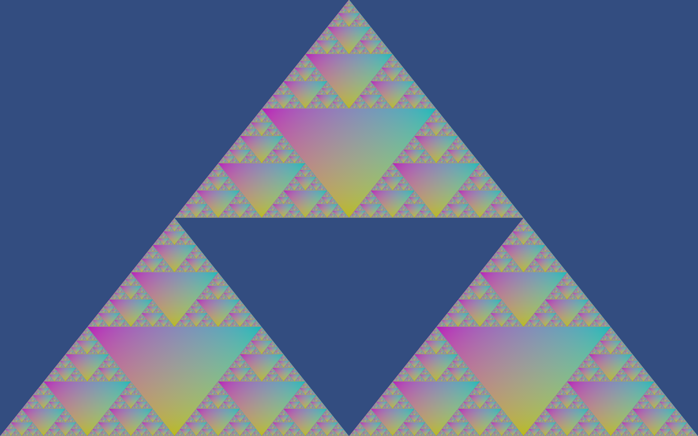

# Sierpinksi Triangle
The code in main.cpp attempts to draw the Sierpinski Triangle. Coded in OpenGL.

Can be optimized further, as this is my first attempt, and can be made much more beautiful such as removing triangles not needed.

